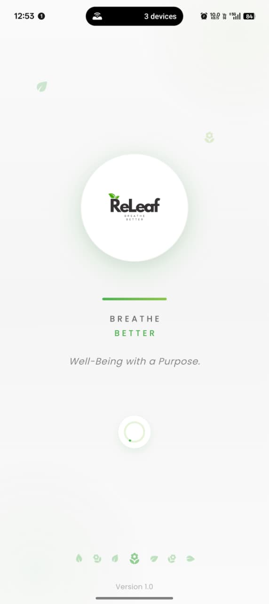
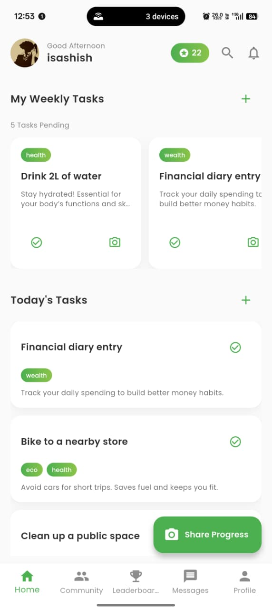
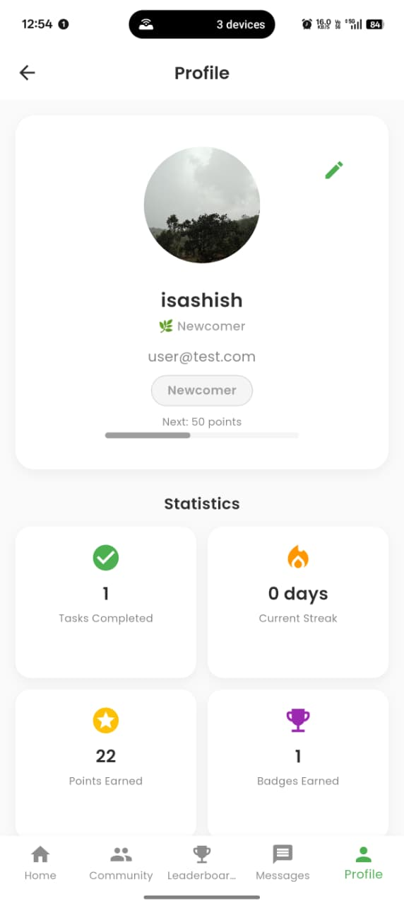

# ReLeaf – Environmental Sustainability & Task Recommendation App

ReLeaf is a Flutter-based mobile application designed to promote environmental sustainability by recommending eco-friendly activities to users.  
The app encourages users to contribute to the environment through simple, everyday actions — powered by machine learning recommendations using TensorFlow Lite.

---

## Overview

ReLeaf empowers individuals to make a positive environmental impact by completing tasks like recycling, planting trees, reducing waste, and conserving energy.  
The app suggests personalized actions based on user history, interests, and previous activity patterns.

---

## Features

- Personalized Recommendations using TensorFlow Lite (TFLite)
- Firebase Authentication and Database Integration
- Task Management and Progress Tracking
- Social Feed and Post Sharing
- Firebase Storage for Image Hosting
- Community Engagement (Likes, Comments, Shares)

---

## Machine Learning Model

The app uses a TensorFlow Lite (TFLite) model for on-device inference.  
The model analyzes user behavior and completed tasks to predict the most relevant upcoming actions.

### Model Workflow
1. User completes a task → stored in Firestore.  
2. The local TFLite model processes this data.  
3. Model recommends the next set of eco-tasks based on patterns.  
4. Recommendations are displayed dynamically in the app.

---

## Tech Stack

- **Frontend:** Flutter (Dart)  
- **Backend:** Firebase Firestore & Realtime Database  
- **Authentication:** Firebase Auth  
- **Image Storage:** Firebase Storage  
- **Machine Learning:** TensorFlow Lite  
- **Cloud Messaging:** Firebase Cloud Messaging (optional)

---

## Screenshots

| Splash Screen | Home Screen | Profile Screen |
|---------------|--------------|----------------|
|  |  |  |

---

## Setup & Installation

### 1. Clone the repository
```bash
git clone https://github.com/your-username/releaf.git
cd releaf
```

### 2. Install dependencies
```bash
flutter pub get
```

### 3. Add your Firebase configuration
- Download `google-services.json` (for Android) and place it in `android/app/`.
- Download `GoogleService-Info.plist` (for iOS) and place it in `ios/Runner/`.

### 4. Run the app
```bash
flutter run
```

---

## Firebase Security Rules

Example for post storage:

```js
rules_version = '2';
service firebase.storage {
  match /b/{bucket}/o {
    match /posts/{postId} {
      allow read: if true;
      allow write: if request.auth != null;
    }
  }
}
```

---

## Future Enhancements

- Add gamification and achievement badges  
- Integrate carbon footprint tracking  
- Enable location-based eco-events  
- AI chatbot for sustainability tips  

---

## License

This project is licensed under the **MIT License**.  
See the [LICENSE](./LICENSE) file for more information.

---

## Developed By
  
Master’s in Computer Applications – Final Year  
Focused on AI, Machine Learning, and Mobile App Development
